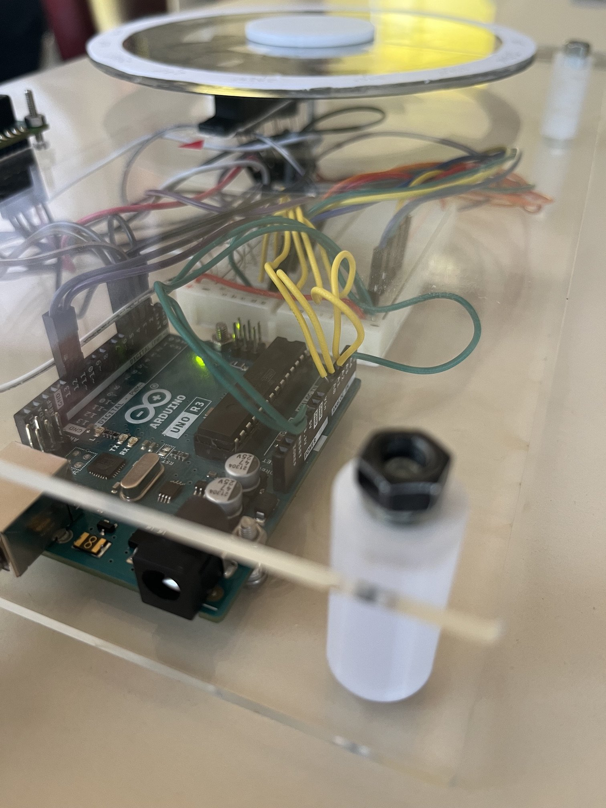
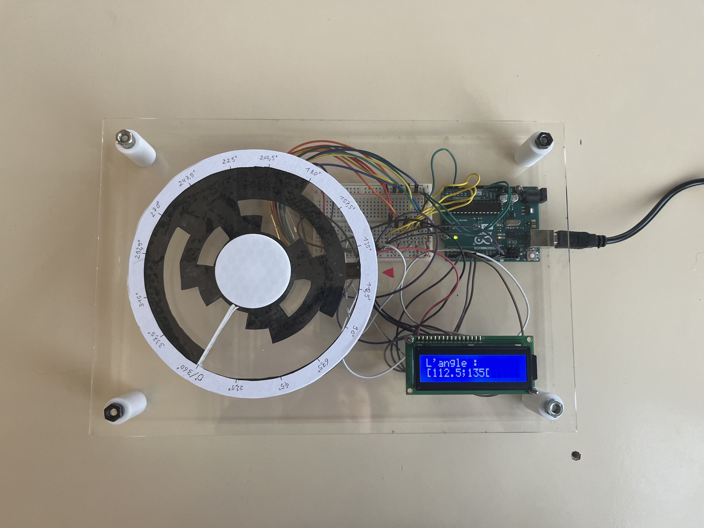
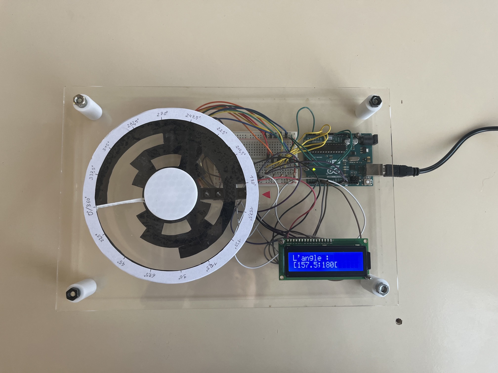

# Angular Sensor using Gray Code



## Overview

This project implements a sensor that measures absolute angular position using a Gray-coded disk and 5 phototransistors. It was developed as the second semester's project of the BUT Mesures Physiques program at IUT Le Creusot, France, with a team of 3 students over 6 months. The system achieves an angular resolution of 22.5° using a 4-bit Gray code.

## Table of Contents

- [How It Works](#how-it-works)
- [Schematic](#schematic)
- [Hardware](#hardware)
- [Repository Structure](#repository-structure)
- [Tools used](#tools-used)
- [Results](#results)
- [Limitations & Future Improvements](#limitations--future-improvements)
- [Team](#team)

## How It Works

1. A disk with a 4-bit Gray code pattern is mounted on a rotating shaft.
2. 5 phototransistors, positioned at fixed points below the disk, detect the presence or absence of light through the printed pattern. (One of the 5 phototransistors purpose is to define a light threshold when the system starts so it adapts to the ambient light.)
3. Each phototransistor's analog reading is compared against the calibrated threshold (`ValueCal + margin(25)`) to produce a binary bit.
4. The 4 bits are combined into an index used to look up the corresponding angle in a lookup table.
5. The resulting angle is displayed on a LCD16X2I2C LCD screen.

## Schematic


## Hardware

| Component | Reference | Quantity |
|---|---|---|
| Microcontroller | Arduino Uno R3 | 1 | |
| Phototransistor | PT331C | 5 | |
| LCD display | LCD16X2I2C | 1 |
| 10kohms resistor | | 5 | |
| 220 ohms resistor | | 1 | |
|Breadboard | MB-102 | 1 |


## Repository Structure

The repository in organised as followed :
```
.
├── src/            # Full program in C++
├── media/           # Pictures of the end result
├── hardware/         # Schematic, component list and cad files
├── docs/           # Report
└── README.md
```

## Tools used

- FreeCAD - mechanical design
- Arduino IDE - firmware developpement
- Thinkercad - [simulation of the system](https://www.tinkercad.com/things/7D7z3j7ged0-capteur-angluaire-a-code-de-grey)


## Results

The end result fulfill is original purpose by displaying the current interval of angle. For evrery test we made, the sensor returned the right angle as shown in the folowing pictures

<table>
  <tr>
    <td></td>
    <td></td>
  </tr>
</table>

## Limitations & Future Improvements

The result we achieved is functioning but lack multiple things in order to be usable correctly. First, the size of the sensor is too large to fit any real scenario usage. Moreover, it is not strong enough to resist any real application. The resolution is also very high, which leads to bad precision.

We could improve the sensor by adding a few more bits in order to improve the resolution by a lot. We could also add functions like a measurement of the rotating speed of the disk or a "relative angle" function.
Obviously, system we made is for education only, so it is far from an industry like sensor.

## Team

This projet was realised entirely with the collaboration of :

- Romane _________
- Jean-Baptiste ________

We all equally contributed to every aspect of this project from coding to 3D design.

Project completed as part of the **BUT Mesures Physiques** program at IUT Le Creusot, 2026.
